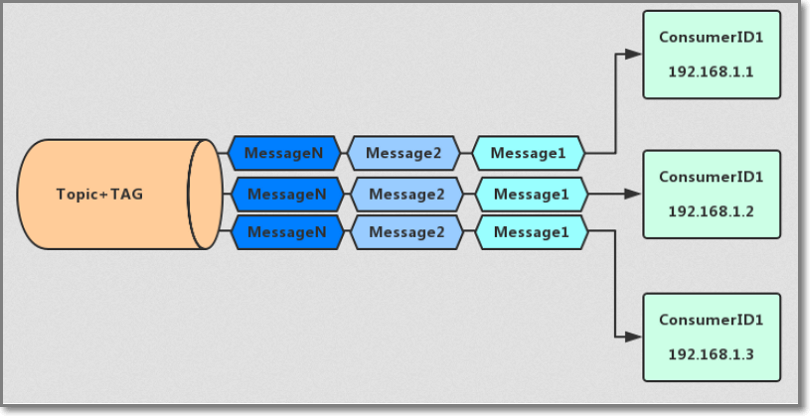
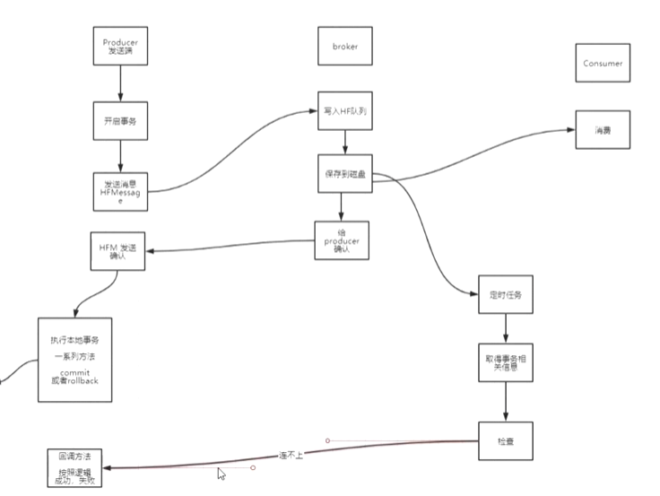
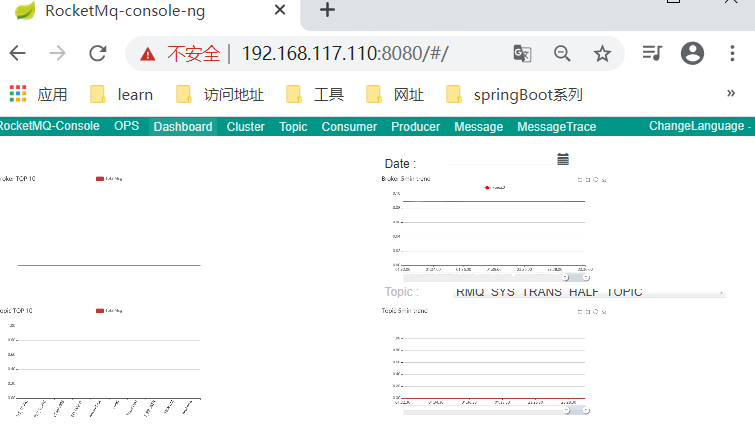
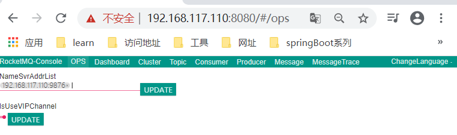
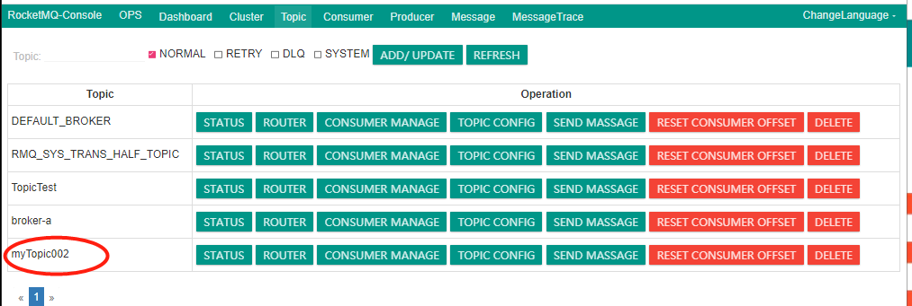
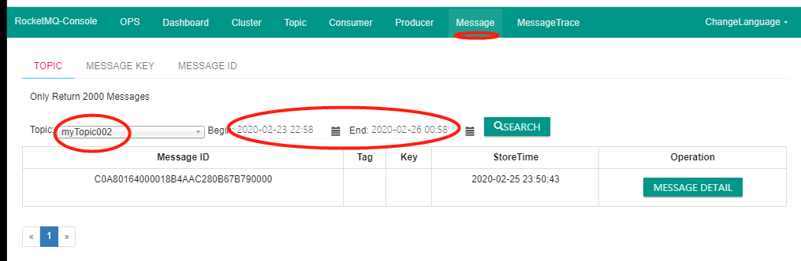
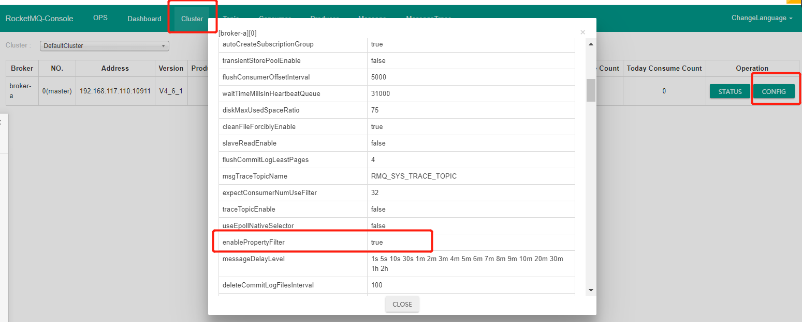

# RocketMq 消息发送

## 一、消息消费模式
消息消费模式由消费者来决定，可以由消费者设置MessageModel来决定消费模式。默认为集群消费模式
```
 consumer.setMessageModel(MessageModel.BROADCASTING); //广播消费模式
 consumer.setMessageModel(MessageModel.CLUSTERING);  //集群消费模式
```

### 集群消息


集群消息是指**集群化部署消费者**
当使用集群消费模式时，MQ 认为任意一条消息只需要被集群内的任意一个消费者处理即可。

*特点*
- 每条消息只需要被处理一次，broker只会把消息发送给消费集群中的一个消费者
- 在消息重投时，不能保证路由到同一台机器上
- 消费状态由broker维护

### 广播消息


当使用广播消费模式时，MQ 会将每条消息推送给集群内所有注册过的客户端，保证消息至少被每台机器消费一次。

**特点**
- 消费进度由consumer维护
- 保证每个消费者消费一次消息
- 消费失败的消息不会重投


## 二、消息发送
### 1.同步发送
消息发送时进入同步等待状态，可以保证消息投递一定到达。(可靠同步消息)
在重要的通知消息，SMS通知，SMS营销系统等广泛的场景中使用可靠的同步传输。
```
 producer.send(message);
```
### 2.异步发送
想要快速发送消息，又不想丢失的时候可以使用异步消息。(可靠异步消息)
异步传输通常用于对时间敏感的业务场景中。
```
producer.send(message, new SendCallback() {...});
```

### 3.单项消息
只发送消息，不等待服务器响应，只发送请求不等待应答。此方式发送消息的过程耗时非常短，一般在微秒级别。
单向传输用于要求中等可靠性的情况，例如日志收集。
```
 producer.sendOneway(message);
```

### 4.批量消息发送
可以多条消息打包一起发送，减少网络传输次数提高效率。
- 批量消息要求必要具有同一topic、相同消息配置
- 不支持延时消息
- 建议一个批量消息最好不要超过1MB大小
- 如果不确定是否超过限制，可以手动计算大小分批发送
  `producer.send(Collection c) `方法可以接受一个集合 实现批量发送
```
 public SendResult send(
        Collection<Message> msgs) throws MQClientException, RemotingException, MQBrokerException, InterruptedException {
        return this.defaultMQProducerImpl.send(batch(msgs));
    }
```
如果不确定一次批量发送是否超过大小限制(1MB),那么可以拆分列表，拆表可以参考官网实例

### 5.消息延迟发送
 RocketMQ使用**messageDelayLevel**可以设置延迟投递

 **默认配置**
 ```
 messageDelayLevel	1s 5s 10s 30s 1m 2m 3m 4m 5m 6m 7m 8m 9m 10m 20m 30m 1h 2h
 ```
  这个配置项配置了从1级开始，各级延时的时间，可以修改这个指定级别的延时时间；
  时间单位支持：s、m、h、d，分别表示秒、分、时、天；

若要设置为延迟投递，需要在`broker.conf `中添加如上配置,并在发送消息时设置延迟时间级别
 ```
 message.setDelayTimeLevel(1); 
 ```

#### 重试机制
投递消息或者消费消息，由于网络的原因导致消息丢失，可以通过重试机制来投递或发送消息
**默认超时时间**,sendMsgTimeout默认3000毫秒,即3秒，可通过修改设置
```
producer.setSendMsgTimeout(5000);
```

##### producer重试
当在超时时间内未收到broker的确认信号，会重试,可以配置重试次数或者当发送的broker错误时，可以尝试给其它broker发
```
// 异步发送时 重试次数，默认 2
producer.setRetryTimesWhenSendAsyncFailed(1);
// 同步发送时 重试次数，默认 2
producer.setRetryTimesWhenSendFailed(1);	
// 是否向其他broker发送请求 默认false
producer.setRetryAnotherBrokerWhenNotStoreOK(true);
```
producer在发送同步/异步可靠消息后，会接收到SendResult，表示消息发送成功
SendResult其中属性sendStatus表示了broker是否真正完成了消息存储
当sendStatus!="ok"的时候，应该重新发送消息，避免丢失。

##### consumer重试
正常情况下在consumer真正消费完消息后应该发送ack，通知broker该消息已正常消费，从queue中剔除
当ack因为网络原因无法发送到broker，broker会认为词条消息没有被消费，此后会开启消息重投机制把消息再次投递到consumer
消费超时时间（单位分种，默认15分种）:`consumer.setConsumeTimeout()`
设置`RECONSUME_LATER`可以重新消费

##### broker重试
只有在消息模式为MessageModel.CLUSTERING集群模式时，Broker才会自动进行重试，广播消息不重试
重投使用`messageDelayLevel`
默认值
```
messageDelayLevel	1s 5s 10s 30s 1m 2m 3m 4m 5m 6m 7m 8m 9m 10m 20m 30m 1h 2h
```

### 6.事务消息
分布式系统中的事务可以使用TCC（Try、Confirm、Cancel）、2pc(Two-phase Commit)来解决分布式系统中的消息原子性
RocketMQ 4.3+提供分布事务功能，通过 RocketMQ 事务消息能达到分布式事务的最终一致
2pc:二阶段提交,RocketMQ采用2pc实现事务控制，需要实现XO协议，完成分布式控制，分为二阶段，第一阶段尝试提交，第二阶段确认ok。
第一阶段尝试提交，如果本地事务执行成功，再提交一次。第一次提交的数据不会立即生效，这些数据会维持一个状态，这个状态是不可用的，当第二阶段确认后这个数据才是可用的，如果第二阶段发的不是确认信号，这个数据就是临时数据，状态是不可用的。


####  RocketMQ实现事务流程及方式
**Half Message：**预处理消息，当broker收到此类消息后，会存储到RMQ_SYS_TRANS_HALF_TOPIC的消息消费队列中
**检查事务状态：**Broker会开启一个定时任务，消费RMQ_SYS_TRANS_HALF_TOPIC队列中的消息，每次执行任务会向消息发送者确认事务执行状态（提交、回滚、未知），如果是未知，等待下一次回调。
**超时：**如果超过回查次数，默认回滚消息



Producer发送端开启事务，发送Half Message消息给broker，broker接受到半消息后，知道发送端需要开启事务，那broker会将半消息写入会存储到RMQ_SYS_TRANS_HALF_TOPIC(HF)的消息消费队列中，将消息保存到磁盘，给Producer确认。
Producer收到半消息确认后，执行本地事务,如果执行rollback，需要将HF消息队列里的消息撤销，磁盘里的数据会被清除，如果commit，那会将真正的消息写入消息队列并撤销HF消息。此时消息才能被Consumer消费。
但是如果事务执行时间过长，broker不知道事务需要多久，所以broker开启一个定时任务，从半消息队列中取到事务的相关信息，去定时检查真正事务执行状态。
Producer提供一个回调方法，按照业务逻辑回馈本地事务执行成功或失败，broker会调起回调方法，当回调能连接上，且返回成功，说明之前producer事务未commit。
回调如果连接不上，那重连，多次连不上，那将事务置未失败。回调如果超时，默认事务回滚。
consumer只有当消息是真正的可用状态，才能消费。

##### TransactionListener的两个方法
executeLocalTransaction:半消息发送成功触发此方法来执行本地事务
checkLocalTransaction:broker将发送检查消息来检查事务状态，并将调用此方法来获取本地事务状态

##### 本地事务执行状态
**LocalTransactionState.COMMIT_MESSAGE**
执行事务成功，确认提交
**LocalTransactionState.ROLLBACK_MESSAGE**
回滚消息，broker端会删除半消息
**LocalTransactionState.UNKNOW**
暂时为未知状态，等待broker回查


## 二、消息消费
### 消息订阅
消费者使用subscribe方法进行过滤，第一个参数为订阅的topic，第二个为过滤的TAG
```
consumer.subscribe("TopicTest", "TagA||TagB");
```
### 顺序消费
顺序消费表示消息消费的顺序同生产者为每个消息队列发送的顺序一致，
所以如果正在处理全局顺序是强制性的场景，需要确保使用的主题只有一个消息队列。
若消费者同一主题有多个消息队列，那只能保证局部顺序,即同一个队列queue中有序。
producer发送消息有序:
producer的send()方法中添加MessageQueueSelector接口的实现类，并重写select选择使用的队列，将消息发送到同一个队列中
```
  producer.send(msg, new MessageQueueSelector() {
                @Override
                public MessageQueue select(List<MessageQueue> mqs, Message msg, Object arg) {
                    //选择队列
                    return mqs.get(arg1);
                }
            }, 1);
```
consumer顺序消费:注册监听器时使用`MessageListenerOrderly`监听器
```
consumer.registerMessageListener(new MessageListenerOrderly() {
            @Override
            public ConsumeOrderlyStatus consumeMessage(List<MessageExt> msgs, ConsumeOrderlyContext context) {
                for (MessageExt msg : msgs) {
                    System.out.println(Thread.currentThread() + ":" + new String(msg.getBody()));
                }
                return ConsumeOrderlyStatus.SUCCESS;
            }
        });
```
#### 如何让RocketMQ保证消息的顺序消费
- 同一topic
- 同一个QUEUE
- 发消息的时候一个线程去发送消息
- 消费的时候 一个线程 消费一个queue里的消息
- 多个queue 只能保证单个queue里的顺序

**保证有序参与因素**
- FIFO
- 队列内保证有序
- 消费线程

### 并发消费
使用``MessageListenerConcurrently`监听器实现并发消费
```
 consumer.registerMessageListener(new MessageListenerConcurrently(....))
```
### 消息过滤
####  TAG过滤
可以使用tag来过滤消费
 在Producer中使用Tag：
```
Message msg = new Message("TopicTest","TagA" ,("Hello RocketMQ " ).getBytes(RemotingHelper.DEFAULT_CHARSET));
```
  在Consumer中订阅Tag：
```
consumer.subscribe("TopicTest", "TagA||TagB");// * 代表订阅Topic下的所有消息
```

#### SQL表达式过滤
消费者将收到包含TAGA或TAGB或TAGB的消息. 但限制是一条消息只能有一个标签，而这对于复杂的情况可能无效。 在这种情况下，您可以使用SQL表达式筛选出消息.
##### 配置
在`broker.conf `中添加配置
```
enablePropertyFilter=true
```
启动broker 加载指定配置文件
```
../bin/mqbroker -n 192.168.150.113:9876 -c broker.conf 
```

##### **实例**
```
        MessageSelector selector = MessageSelector.bySql("order > 5");
        consumer.subscribe("topic", selector);
```

##### 语法
RocketMQ只定义了一些基本的语法来支持这个功能。 你也可以很容易地扩展它.
1. 数字比较, 像 `>`, `>=`, `<`, `<=`, `BETWEEN`, `=`;
2. 字符比较, 像 `=`, `<>`, `IN`;
3. `IS NULL` 或者 `IS NOT NULL`;
4. 逻辑运算`AND`, `OR`, `NOT`;

常量类型是:
1. 数字, 像123, 3.1415;
2. 字符串, 像‘abc’,必须使用单引号;
3. `NULL`, 特殊常数;
4. 布尔常量, `TRUE` 或`FALSE`;

   ​


# Rocket-API开发
### 0.启动准备
1.测试前进入rocketMQ的安装目录bin目录下，分别在2个会话窗口执行以下命令，启动rocket
```
./mqnamesrv
./mqbroker -n localhost:9876
```

namesrv启动成功如下:
```
[root@xuexi bin]# ./mqnamesrv 
Java HotSpot(TM) 64-Bit Server VM warning: Using the DefNew young collector with the CMS collector is deprecated and will likely be removed in a future release
Java HotSpot(TM) 64-Bit Server VM warning: UseCMSCompactAtFullCollection is deprecated and will likely be removed in a future release.
The Name Server boot success. serializeType=JSON
```

mqbroker启动成功如下:
```
[root@xuexi ~]# cd /opt/module/rocketmq-4.6.1/bin
[root@xuexi bin]# ./mqbroker -n localhost:9876
The broker[xuexi, 192.168.117.110:10911] boot success. serializeType=JSON and name server is localhost:9876
```

2.可以启动控制台程序，然后在浏览器中进行监控
```
java -jar rocketmq-console-ng-1.0.1.jar --rocketmq.config.namesrvAddr=127.0.0.1:9876
```

修改监控的namesrv地址列表


2.pom文件中添加依赖
```
       <dependency>
            <groupId>org.apache.rocketmq</groupId>
            <artifactId>rocketmq-client</artifactId>
            <version>4.6.1</version>
        </dependency>
```
### 1.同步消息发送示例
#### producer
```
import org.apache.rocketmq.client.consumer.DefaultMQPushConsumer;
import org.apache.rocketmq.client.exception.MQBrokerException;
import org.apache.rocketmq.client.exception.MQClientException;
import org.apache.rocketmq.client.producer.DefaultMQProducer;
import org.apache.rocketmq.client.producer.SendResult;
import org.apache.rocketmq.common.message.Message;
import org.apache.rocketmq.remoting.exception.RemotingException;

import java.util.ArrayList;

/**
 * 生产者-同步消息发送
 */
public class Producer {
    public static void main(String[] args) throws Exception {
        //
        DefaultMQProducer producer = new DefaultMQProducer("my_pGroup");
        //设置nameserver地址
        producer.setNamesrvAddr("192.168.117.110:9876");
        //启动生产者
        producer.start();
        Message message = new Message("myTopic002", "消息1".getBytes());
        //发送同步消息
        //（会发生等待，消费者消费了消息，会给broker ack应答，broker若在超时事件内没有收到ack，会将消息重投，可能会被consumer集群的其它消费者消费）
        SendResult sendResult = producer.send(message);
        System.out.println("sendResult" + sendResult);
        //关闭
        producer.shutdown();
        System.out.println("已经停机");
    }
}
```
#### consumer
````
import org.apache.rocketmq.client.consumer.DefaultMQPushConsumer;
import org.apache.rocketmq.client.consumer.listener.ConsumeConcurrentlyContext;
import org.apache.rocketmq.client.consumer.listener.ConsumeConcurrentlyStatus;
import org.apache.rocketmq.client.consumer.listener.MessageListenerConcurrently;
import org.apache.rocketmq.client.exception.MQClientException;
import org.apache.rocketmq.common.message.MessageExt;
import org.apache.rocketmq.common.protocol.heartbeat.MessageModel;

import java.util.List;

/**
 * 消费者
 */
public class Consumer {
    public static void main(String[] args) throws MQClientException {
        String consumerGroup = "xxoocsm";
        DefaultMQPushConsumer consumer = new DefaultMQPushConsumer(consumerGroup);
        //设置消费者namesever的地址
        consumer.setNamesrvAddr("192.168.117.110:9876");
        //设置要消费的topic，和生产者生产数据的topic一致
        //参数一topic，参数2，过滤器: *表示不过滤
        consumer.subscribe("myTopic002", "*");

        consumer.registerMessageListener(new MessageListenerConcurrently() {
            @Override
            public ConsumeConcurrentlyStatus consumeMessage(List<MessageExt> list, ConsumeConcurrentlyContext consumeConcurrentlyContext) {
                for (MessageExt message : list) {
                    System.out.println(consumerGroup + "消费消息：" + new String(message.getBody()));
                }
                //默认情况下，这条消息只会被一个customer消费到点对点
                //消息被消费了，broker会修改meassage的状态，ack
                return ConsumeConcurrentlyStatus.CONSUME_SUCCESS;
            }
        });
        //消费者-消费消息的模式：
        //   MessageModel.BROADCASTING-广播模式
        //  MessageModel.CLUSTERING - 集群模式
        consumer.setMessageModel(MessageModel.CLUSTERING);
        //启动消费者
        consumer.start();
        System.out.println(consumerGroup + "Consumer start....");
    }
}
````
在监控页面可以看到监控到消息的topic,message,consumer,producter等

message



### 2.异步消息发送示例
```
import org.apache.rocketmq.client.producer.DefaultMQProducer;
import org.apache.rocketmq.client.producer.SendCallback;
import org.apache.rocketmq.client.producer.SendResult;
import org.apache.rocketmq.common.message.Message;

import java.util.ArrayList;

/**
 * 生产者-异步发送消息
 */
public class ProducerAnsy {
    public static void main(String[] args) throws Exception {
        DefaultMQProducer producer = new DefaultMQProducer("my_pGroup");
        //设置nameserver地址
        producer.setNamesrvAddr("192.168.117.110:9876");
        //启动生产者
        producer.start();

        Message message = new Message("myTopic002", "消息2".getBytes());
        //设置异步发送失败后的
        producer.setRetryTimesWhenSendAsyncFailed(0);
        //1.异步可靠消息
        //不会阻塞，等待broker的确定;而是采用事件监听方式接受broker返回的确定
        producer.send(message, new SendCallback() {
            @Override
            public void onSuccess(SendResult sendResult) {
                System.out.println("消息发送成功...");
                System.out.println("sendResult" + sendResult);
            }

            @Override
            public void onException(Throwable throwable) {
                //如果发生异常，尝试重投，或者调用业务逻辑处理
                throwable.printStackTrace();
                System.out.println("发生异常");
            }
        });
        System.out.println("发送...");
    }
}
```

### 3.单向消息发送示例
```
import org.apache.rocketmq.client.producer.DefaultMQProducer;
import org.apache.rocketmq.client.producer.SendCallback;
import org.apache.rocketmq.client.producer.SendResult;
import org.apache.rocketmq.common.message.Message;

/**
 * 生产者-单项消息发送
 */
public class ProducerOneWay {
    public static void main(String[] args) throws Exception {
        DefaultMQProducer producer = new DefaultMQProducer("my_pGroup");
        //设置nameserver地址
        producer.setNamesrvAddr("192.168.117.110:9876");
        //启动生产者
        producer.start();
        Message message = new Message("myTopic002", "消息3".getBytes());
        //单向消息,只发送不保证一定发送成功，失败了消息不会重投，因此有可能会丢失消息
        producer.sendOneway(message);
        System.out.println("发送成功");
        //关闭
        producer.shutdown();
        System.out.println("已经停机");
    }
}
```

### 4.批量发送示例(一次发送不超过1MB)
```
import org.apache.rocketmq.client.producer.DefaultMQProducer;
import org.apache.rocketmq.client.producer.SendResult;
import org.apache.rocketmq.common.message.Message;

import java.util.ArrayList;

/**
 * 生产者-批量发送(一次只发送不超过1MiB的消息)
 */
public class ProducerBatch {

    public static void main(String[] args) throws Exception {
        //1.创建生产者
        DefaultMQProducer producer = new DefaultMQProducer("my_pGroup");
        //设置nameserver地址
        producer.setNamesrvAddr("192.168.117.110:9876");
        //启动生产者
        producer.start();
        //如果一次只发送不超过1MiB的消息，则可以轻松使用批处理
        Message msg1 = new Message("myTopic002", "批量消息1".getBytes());
        Message msg2 = new Message("myTopic002", "批量消息2".getBytes());
        Message msg3 = new Message("myTopic002", "批量消息3".getBytes());

        ArrayList<Message> list = new ArrayList<Message>();
        list.add(msg1);
        list.add(msg2);
        list.add(msg3);
        //批量发送消息
        SendResult sendResult3 = producer.send(list);

        System.out.println(sendResult3);
        //关闭
        producer.shutdown();
        System.out.println("已经停机");
    }
}
```

### 5.延迟消息发送示例
```
import org.apache.rocketmq.client.producer.DefaultMQProducer;
import org.apache.rocketmq.client.producer.SendResult;
import org.apache.rocketmq.common.message.Message;

import java.util.ArrayList;

/**
 * 生产者-延迟发送
 */
public class ProducerSchedule {

    public static void main(String[] args) throws Exception {
        //1.创建生产者
        DefaultMQProducer producer = new DefaultMQProducer("my_pGroup");
        //设置nameserver地址
        producer.setNamesrvAddr("192.168.117.110:9876");
        //启动生产者
        producer.start();
        System.out.println("延迟消息发送==============");
        long startTime = System.currentTimeMillis();
        Message message = new Message("myTopic002", "延迟消息1".getBytes());
        //设置broker.conf,添加延迟配置
        // messageDelayLevel	1s 5s 10s 30s 1m 2m 3m 4m 5m 6m 7m 8m 9m 10m 20m 30m 1h 2h
        //这个配置项配置了从1级开始，各级延时的时间，可以修改这个指定级别的延时时间；
        //设置消息指定级别为1，表示消息在在1秒后发送
        message.(1);
        SendResult sendResult = producer.send(message);
        System.out.println(sendResult);
        System.out.println("==========" + (System.currentTimeMillis() - startTime));
    }
}
```

### 6.事务消息发送示例
```
import org.apache.rocketmq.client.producer.*;
import org.apache.rocketmq.common.message.Message;
import org.apache.rocketmq.common.message.MessageExt;

/**
 * Created by yumaoying
 * 生产者-事务消息
 */
public class ProducerTransaction {
    public static void main(String[] args) throws Exception {
        //使用事务TransactionMQProducer
        TransactionMQProducer producer = new TransactionMQProducer("my_pGroup2");
        //设置nameserver地址
        producer.setNamesrvAddr("192.168.117.110:9876");
        System.out.println("测试事务消息======================");
        //回调方法
        producer.setTransactionListener(new TransactionListener() {
            @Override
            public LocalTransactionState executeLocalTransaction(Message message, Object o) {
                //在回调方法里执行本地事务
                // ....一系列方法，
                System.out.println("executeLocalTransaction==========");
                System.out.println("msg:" + new String(message.getBody()));
                return LocalTransactionState.UNKNOW;
            }

            @Override
            public LocalTransactionState checkLocalTransaction(MessageExt messageExt) {
                System.out.println("checkLocalTransaction==========");
                System.out.println("checkLocalTransaction msg:" + new String(messageExt.getBody()));
                //  broker端回调，检查事务(当上面的本地事务执行时间过长，broker端回调检查事务)
                // return LocalTransactionState.COMMIT_MESSAGE;
                //回滚的时候，回滚的是半消息
                //return LocalTransactionState.ROLLBACK_MESSAGE;
                //未知时，回再次调用检查
                return LocalTransactionState.UNKNOW;
            }
        });
        //启动生产者
        producer.start();
        Message message = new Message("myTopic002", "测试事务消息1".getBytes());
        //发送事务消息
        TransactionSendResult result = producer.sendMessageInTransaction(message, null);
        System.out.println("TransactionSendResult" + result);
        //关闭
        System.out.println("已经停机");
    }
}
```
执行结果,半消息未提交，消息会重投，重投时间可参考messageDelayLevel配置，在监控页面可以看到topic为RMQ_SYS_TRANS_HALF_TOPIC的有测试消息
```
测试事务消息======================
executeLocalTransaction==========
msg:测试事务消息1
TransactionSendResultSendResult [sendStatus=SEND_OK, msgId=C0A80164000018B4AAC285E9EB1C0000, offsetMsgId=null, messageQueue=MessageQueue [topic=myTopic002, brokerName=xuexi, queueId=1], queueOffset=0]
checkLocalTransaction==========
checkLocalTransaction msg:测试事务消息1

```


### 7.顺序消费示例
#### producer
````
import org.apache.rocketmq.client.producer.DefaultMQProducer;
import org.apache.rocketmq.client.producer.MessageQueueSelector;
import org.apache.rocketmq.client.producer.SendResult;
import org.apache.rocketmq.common.message.Message;
import org.apache.rocketmq.common.message.MessageQueue;

import java.util.ArrayList;
import java.util.List;

/**
 * 顺序写入消息
 * 需要producer在发消息时保证数据发送时在同一个queue，同一个topic里
 * 使用同一个线程发消息是，发送顺序和写入broker顺序一致
 */
public class ProducerOrder {
    public static void main(String[] args) throws Exception {
        //1.创建生产者，使用DefaultMQProducer发消息，是一个线程
        DefaultMQProducer producer = new DefaultMQProducer("my_pGroup");
        //设置nameserver地址
        producer.setNamesrvAddr("192.168.117.110:9876");
        //启动生产者
        producer.start();
        System.out.println("顺序发送.............");
        for (int i = 0; i < 10; i++) {
            //顺序消费时，发送的topic一致
            Message msg = new Message("myTopic002", ("顺序消息" + i).getBytes());
            //send()方法中MessageQueueSelector用于指定消息队列，queue选择器，向topic中的哪个queue去写消息
            producer.send(msg, new MessageQueueSelector() {
                //设置发送的queue是同一个

                /***
                 *
                 * @param mqs 队列
                 * @param msg 发送的消息
                 * @param arg 参数与send方法的arg对应
                 * @return
                 */
                @Override
                public MessageQueue select(List<MessageQueue> mqs, Message msg, Object arg) {
                    Integer arg1 = (Integer) arg;
                    MessageQueue messageQueue = mqs.get(arg1);
                    return messageQueue;
                }
            }, 1);
            System.out.println(Thread.currentThread() + ":发送消息，" + msg);
        }
        //关闭
        producer.shutdown();
    }
}
````
#### consumer
```
/**
 * 顺序消费消息
 */
public class ConsumerOrder {
    public static void main(String[] args) throws MQClientException {
        String consumerGroup = "consumerGroup1";
        DefaultMQPushConsumer consumer = new DefaultMQPushConsumer(consumerGroup);
        consumer.setNamesrvAddr("192.168.117.110:9876");
        consumer.subscribe("myTopic002", "*");
        //注册监听器
        //使用MessageListenerOrderly监听器，顺序消费，它在一个queue里不开多线程，它会对一个queue开启一个线程，多个queue开启多个线程
        consumer.registerMessageListener(new MessageListenerOrderly() {
            @Override
            public ConsumeOrderlyStatus consumeMessage(List<MessageExt> msgs, ConsumeOrderlyContext context) {
                for (MessageExt msg : msgs) {
                    System.out.println(Thread.currentThread() + ":" + new String(msg.getBody()));
                }
                return ConsumeOrderlyStatus.SUCCESS;
            }
        });
        //启动消费者
        consumer.start();
        System.out.println(consumerGroup + "Consumer start....");
    }
}
```
producer执行结果
```
顺序发送.............
Thread[main,5,main]:发送消息，Message{topic='myTopic002', flag=0, properties={UNIQ_KEY=C0A80164000018B4AAC28AFAFF610000, WAIT=true}, body=[-23, -95, -70, -27, -70, -113, -26, -74, -120, -26, -127, -81, 48], transactionId='null'}
Thread[main,5,main]:发送消息，Message{topic='myTopic002', flag=0, properties={UNIQ_KEY=C0A80164000018B4AAC28AFAFF6A0001, WAIT=true}, body=[-23, -95, -70, -27, -70, -113, -26, -74, -120, -26, -127, -81, 49], transactionId='null'}
Thread[main,5,main]:发送消息，Message{topic='myTopic002', flag=0, properties={UNIQ_KEY=C0A80164000018B4AAC28AFAFF6E0002, WAIT=true}, body=[-23, -95, -70, -27, -70, -113, -26, -74, -120, -26, -127, -81, 50], transactionId='null'}
Thread[main,5,main]:发送消息，Message{topic='myTopic002', flag=0, properties={UNIQ_KEY=C0A80164000018B4AAC28AFAFF760003, WAIT=true}, body=[-23, -95, -70, -27, -70, -113, -26, -74, -120, -26, -127, -81, 51], transactionId='null'}
Thread[main,5,main]:发送消息，Message{topic='myTopic002', flag=0, properties={UNIQ_KEY=C0A80164000018B4AAC28AFAFF7A0004, WAIT=true}, body=[-23, -95, -70, -27, -70, -113, -26, -74, -120, -26, -127, -81, 52], transactionId='null'}
Thread[main,5,main]:发送消息，Message{topic='myTopic002', flag=0, properties={UNIQ_KEY=C0A80164000018B4AAC28AFAFF7E0005, WAIT=true}, body=[-23, -95, -70, -27, -70, -113, -26, -74, -120, -26, -127, -81, 53], transactionId='null'}
Thread[main,5,main]:发送消息，Message{topic='myTopic002', flag=0, properties={UNIQ_KEY=C0A80164000018B4AAC28AFAFF830006, WAIT=true}, body=[-23, -95, -70, -27, -70, -113, -26, -74, -120, -26, -127, -81, 54], transactionId='null'}
Thread[main,5,main]:发送消息，Message{topic='myTopic002', flag=0, properties={UNIQ_KEY=C0A80164000018B4AAC28AFAFF870007, WAIT=true}, body=[-23, -95, -70, -27, -70, -113, -26, -74, -120, -26, -127, -81, 55], transactionId='null'}
Thread[main,5,main]:发送消息，Message{topic='myTopic002', flag=0, properties={UNIQ_KEY=C0A80164000018B4AAC28AFAFF8E0008, WAIT=true}, body=[-23, -95, -70, -27, -70, -113, -26, -74, -120, -26, -127, -81, 56], transactionId='null'}
Thread[main,5,main]:发送消息，Message{topic='myTopic002', flag=0, properties={UNIQ_KEY=C0A80164000018B4AAC28AFAFF920009, WAIT=true}, body=[-23, -95, -70, -27, -70, -113, -26, -74, -120, -26, -127, -81, 57], transactionId='null'}
```
consumer执行结果,可看到消息是有序的
```
consumerGroup1Consumer start....
Thread[ConsumeMessageThread_1,5,main]:顺序消息0
Thread[ConsumeMessageThread_1,5,main]:顺序消息1
Thread[ConsumeMessageThread_1,5,main]:顺序消息2
Thread[ConsumeMessageThread_2,5,main]:顺序消息3
Thread[ConsumeMessageThread_3,5,main]:顺序消息4
Thread[ConsumeMessageThread_4,5,main]:顺序消息5
Thread[ConsumeMessageThread_5,5,main]:顺序消息6
Thread[ConsumeMessageThread_6,5,main]:顺序消息7
Thread[ConsumeMessageThread_7,5,main]:顺序消息8
Thread[ConsumeMessageThread_8,5,main]:顺序消息9
```

### 8.并发消费及tag过滤示例
producer
```
import org.apache.rocketmq.client.producer.DefaultMQProducer;
import org.apache.rocketmq.common.message.Message;

/**
 * 生产者-tag过滤
 */
public class ProducerTag {
    public static void main(String[] args) throws Exception {
        DefaultMQProducer producer = new DefaultMQProducer("my_pGroup");
        //设置nameserver地址
        producer.setNamesrvAddr("192.168.117.110:9876");
        //启动生产者
        producer.start();
        for (int i = 0; i < 5; i++) {
            //tag是用来过滤的，用于消息分组
            //key主要是用来业务处理，找消息，一般用于关联
            Message message = new Message("myTopic002", "tag-1", "key-1", ("消息" + i).getBytes());
            //单向消息,只发送不保证一定发送成功，失败了消息不会重投，因此有可能会丢失消息
            producer.send(message);
        }
        System.out.println("发送成功");
        //关闭
        producer.shutdown();
        System.out.println("已经停机");
    }
}
```
consumer
```
import org.apache.rocketmq.client.consumer.DefaultMQPushConsumer;
import org.apache.rocketmq.client.consumer.listener.ConsumeConcurrentlyContext;
import org.apache.rocketmq.client.consumer.listener.ConsumeConcurrentlyStatus;
import org.apache.rocketmq.client.consumer.listener.MessageListenerConcurrently;
import org.apache.rocketmq.client.exception.MQClientException;
import org.apache.rocketmq.common.message.MessageExt;
import org.apache.rocketmq.common.protocol.heartbeat.MessageModel;

import java.util.List;

/**
 * 消费者-只接受某个tag的消息
 */
public class ConsumerTag {
    public static void main(String[] args) throws MQClientException {
        String consumerGroup = "xxoocsm-2";
        DefaultMQPushConsumer consumer = new DefaultMQPushConsumer(consumerGroup);
        //设置消费者namesever的地址
        consumer.setNamesrvAddr("192.168.117.110:9876");
        //设置要消费的topic，和生产者生产数据的topic一致
        //参数一topic，参数2，过滤器: 只消费tag-1的消息
        consumer.subscribe("myTopic002", "tag-1");

        consumer.registerMessageListener(new MessageListenerConcurrently() {
            @Override
            public ConsumeConcurrentlyStatus consumeMessage(List<MessageExt> list, ConsumeConcurrentlyContext consumeConcurrentlyContext) {
                for (MessageExt message : list) {
                    System.out.println(Thread.currentThread() + ":" + new String(message.getBody()));
                }
                return ConsumeConcurrentlyStatus.CONSUME_SUCCESS;
            }
        });
        consumer.setMessageModel(MessageModel.CLUSTERING);
        //启动消费者
        consumer.start();
        System.out.println(consumerGroup + "Consumer start....");
    }
}
```
执行结果
```
Thread[ConsumeMessageThread_3,5,main]:消息2
Thread[ConsumeMessageThread_1,5,main]:消息1
Thread[ConsumeMessageThread_2,5,main]:消息0
Thread[ConsumeMessageThread_5,5,main]:消息3
Thread[ConsumeMessageThread_4,5,main]:消息4
```

### 9.sql过滤示例
修改RocketMQ安装目录下的conf目录下的broker.conf文件,添加或修改`enablePropertyFilter`属性
```
enablePropertyFilter=true
```

修改后加载broker.conf文件重启broker
```
../bin/mqbroker -n localhost:9876 -c broker.conf 
```

修改后可通过监控页面查看配置是否修改


producer
```
import org.apache.rocketmq.client.producer.DefaultMQProducer;
import org.apache.rocketmq.client.producer.SendResult;
import org.apache.rocketmq.common.message.Message;

import java.util.ArrayList;

/**
 * 生产者-SQL过滤
 */
public class ProducerSql {
    public static void main(String[] args) throws Exception {
        DefaultMQProducer producer = new DefaultMQProducer("my_pGroup");
        //设置nameserver地址
        producer.setNamesrvAddr("192.168.117.110:9876");
        //启动生产者
        producer.start();

        //发送多条消息，
        for (int i = 1; i < 100; i++) {
            Message message = new Message("myTopic003", "tag-1", "key-1", ("消息" + i).getBytes());
            message.putUserProperty("age", String.valueOf(i));
            SendResult sendResult = producer.send(message);
            System.out.println("sendResult" + sendResult);
        }

        producer.shutdown();
        // System.out.println("已经停机");
    }
}
```
consumer
```
import org.apache.rocketmq.client.consumer.DefaultMQPushConsumer;
import org.apache.rocketmq.client.consumer.MessageSelector;
import org.apache.rocketmq.client.consumer.listener.ConsumeConcurrentlyContext;
import org.apache.rocketmq.client.consumer.listener.ConsumeConcurrentlyStatus;
import org.apache.rocketmq.client.consumer.listener.MessageListenerConcurrently;
import org.apache.rocketmq.client.exception.MQClientException;
import org.apache.rocketmq.common.message.MessageExt;
import org.apache.rocketmq.common.protocol.heartbeat.MessageModel;

import java.util.List;

/**
 * 消费者
 */
public class ConsumerSql {
    public static void main(String[] args) throws MQClientException {
        String consumerGroup = "xxoocsm";
        DefaultMQPushConsumer consumer = new DefaultMQPushConsumer(consumerGroup);
        //设置消费者namesever的地址
        consumer.setNamesrvAddr("192.168.117.110:9876");

        //消费者将收到tagA或tagb的消息，但是限制是一条消息只能由一条标签，
        //而对于这种复杂的情况可能无效，在这种情况下，可以使用SQL表达式过滤消息
        //配置，需要在 broker.conf 文件设置添加 enablePropertyFilter=true的配置
        //然后在启动broker时加载指定配置文件  ../bin/mqbroker -n 10 192.168.117.110:9876 -c broker.conf
        MessageSelector messageSelector = MessageSelector.bySql("age>=18 and age<=28");
        consumer.subscribe("myTopic003", messageSelector);

        consumer.registerMessageListener(new MessageListenerConcurrently() {
            @Override
            public ConsumeConcurrentlyStatus consumeMessage(List<MessageExt> list, ConsumeConcurrentlyContext consumeConcurrentlyContext) {
                for (MessageExt message : list) {
                    System.out.println(consumerGroup + "," + new String(message.getBody()));
                }
                return ConsumeConcurrentlyStatus.CONSUME_SUCCESS;
            }
        });
        consumer.setMessageModel(MessageModel.CLUSTERING);
        //启动消费者
        consumer.start();
        System.out.println(consumerGroup + "Consumer start....");
    }
}
```